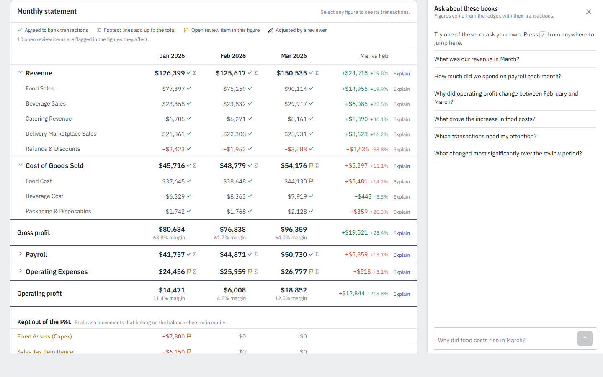
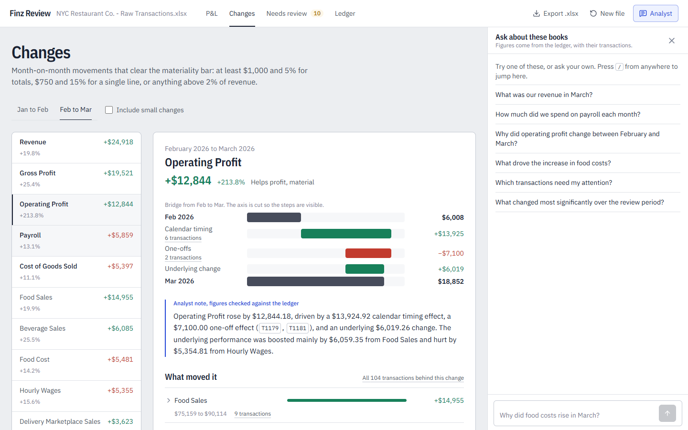
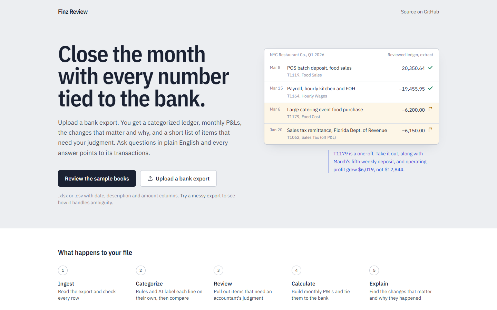
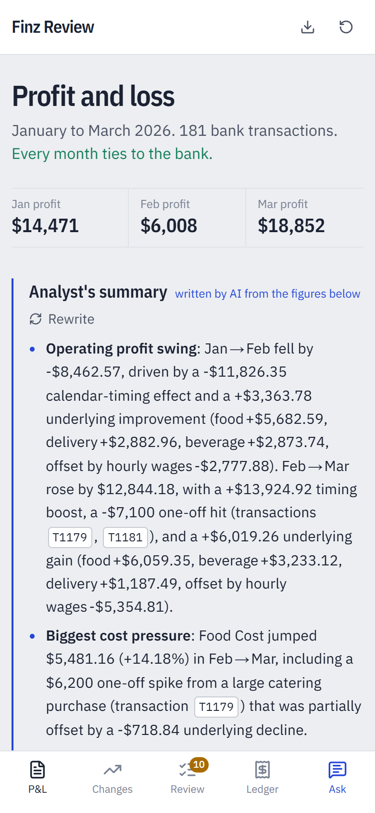

# Finz Review

An AI-native financial review app. Upload a bank export and it categorizes every transaction, builds monthly P&Ls, finds the material variances and explains them, and queues up the items that need a human. An AI analyst answers questions about the books and links every answer back to the transactions behind it.

Built for the Finz SWE internship challenge using the *NYC Restaurant Co.* dataset (181 transactions, Jan–Mar 2026).

[](https://github.com/kushagragarg15/finz/actions/workflows/ci.yml)

**Live app:** _add Vercel URL_. **Walkthrough:** _add video link_.

| Statement with audit tickmarks | Variance bridge with AI note |
|---|---|
|  |  |

| Landing | Phone |
|---|---|
|  |  |

### What's here beyond the brief
- **Every P&L figure carries audit tickmarks**, computed from the ledger: agreed to bank, footed, flagged by an open review item, adjusted by a reviewer.
- **Variance bridges.** Each change is split exactly into calendar timing, one-offs and the underlying change. For example, March's +$12,844 operating profit is only +$6,019 underlying.
- **Answers are checked against the ledger.** Any figure the model states that the engine didn't compute is flagged, and the model is asked to rewrite.
- **A live evaluation harness** (`npm run eval`) that scores the analyst on the brief's questions and on adversarial prompts. See [evals/RESULTS.md](evals/RESULTS.md).
- **Workpaper export to .xlsx**: P&L with tie-out, the categorized ledger, variance decomposition, the review log and the correction audit trail.
- **Shareable links** to any view or variance (e.g. `/#variances/operatingProfit:2026-02->2026-03`), plus a responsive layout down to 375px and CI on every push.

---

## Quick start

```bash
npm install
cp .env.example .env.local        # add GROQ_API_KEY (free at console.groq.com)
npm run dev                       # http://localhost:3000
npm test                          # 26 engine + grounding tests
npm run eval                      # live analyst evaluation (uses the Groq key, ~3 min)
```

Click **Review the sample books**, or drop in any `.xlsx`/`.csv` with date, description and amount columns.

**Try a messy bank export** loads `public/sample/messy-bank-export.csv`. It exercises the rest of the pipeline:
- different column headers, US dates and `$(1,234.56)` amounts;
- a duplicate charge;
- a supplier credit;
- ambiguous lines (Zelle payments, card autopay, IRS EFTPS, Venmo) where rules and AI disagree or are unsure, which puts them in review.

Without a `GROQ_API_KEY` the app still works in **rules-only mode**: categorization, P&L, variances and the review queue all run. The analyst and the AI explanations are turned off, and variance explanations fall back to deterministic templates.

## Stack

| Layer | Choice | Why |
|---|---|---|
| App | Next.js 16 (App Router) + React 19 + Tailwind v4 | One TypeScript codebase for UI and API, one-click Vercel deploy |
| Finance engine | Pure TypeScript in `src/lib/finance` | The same code runs in the browser (instant recalculation after a correction) and on the server (recomputed for every AI request) |
| AI | Groq, `openai/gpt-oss-120b`, OpenAI-compatible tool calling | Fast, free tier, and reliable tool calling (Groq retired its Llama chat models). The model is swappable via `GROQ_MODEL` |
| Parsing | SheetJS | Handles xlsx/xls/csv, Excel serial dates, currency strings |
| State | Zustand, persisted to localStorage | Corrections and resolutions are an append-only log, replayed over the machine classification |
| UI | Tailwind v4 tokens, IBM Plex Sans and Plex Sans Condensed, Lucide icons, [React Bits](https://reactbits.dev) CountUp and ShinyText (via its shadcn registry) | Kept deliberately quiet. See *Design* below |

## Architecture

```
 upload ─► /api/ingest ─► parseWorkbook ─► raw transactions ─┐
                        └► aiCategorize (1 LLM call per ≤40   │  independent opinions
                           distinct patterns) ─► AI map ──────┤
                                                              ▼
 corrections + resolutions (audit log) ─────────► buildWorkspace()  ← deterministic, shared client/server
                                                  ├ rules + AI ensemble → ledger
                                                  ├ computeAllPnl (+ bank reconciliation)
                                                  ├ computeAllVariances (drivers, context facts)
                                                  └ detectReviewItems
                                                              │
         /api/chat ─► tool-calling agent ─► tools read ONLY the workspace ─► answer
                                            └► grounding check ─► retry if a figure isn't in tool output
         /api/explain ─► variance JSON ─► LLM narrative ─► grounding check ─► else template
```

The client never sends computed numbers to the server. It sends the raw transactions plus the correction log, and the server rebuilds the workspace with the same deterministic code before any AI step runs.

## Where AI is used, and why

| Where | What the AI does | Why AI |
|---|---|---|
| **Categorization** (`lib/ai/categorize.ts`) | Classifies each *distinct pattern* (weekly lines collapse into one) into the chart of accounts, with a confidence and a rationale, **independently of the rules** | Handles unfamiliar vendors and descriptions, and reasons about accounting treatment (an "equipment purchase" is capex, not an expense) |
| **Analyst** (`lib/ai/analyst.ts`) | Plans which tools to call, interprets the results, writes the answer and cites transaction IDs | Understanding the question and building the narrative is where language models add value |
| **Variance narratives** (`lib/ai/narrate.ts`) | Turns a deterministic driver breakdown into 2–4 sentences, separating timing effects and one-offs from underlying performance | Explanation, not calculation |
| **Briefing** (`lib/ai/briefing.ts`) | Writes a 5-bullet executive summary over facts the server assembles deterministically. It's one call with no tools, and it gets the same grounding check | |

## Where deterministic logic is used, and why

Everything that produces a number or an accounting decision that must be auditable:

- **Parsing and validation** (`ingest.ts`): header detection, dates, amounts, duplicate IDs.
- **Keyword rules** (`rules.ts`) for the unambiguous cases, plus the **ensemble merge**:
  - rules and AI agree: confidence goes up (`rule+ai`);
  - they disagree: confidence is capped at 55%, both opinions are kept, and the line goes to review;
  - AI only: confidence is capped at 85%;
  - neither: the line goes to suspense.
- **P&L** (`pnl.ts`): Revenue, COGS, Gross Profit, Payroll, OpEx and Operating Profit are sums over the classified ledger. Non-P&L items (capex, loan principal, owner distributions, sales tax, gift cards) are kept below the line.
- **Reconciliation:** each month asserts `operating profit + non-P&L cash = net bank movement`, to the cent.
- **Variances** (`variance.ts`): deltas, % changes, a materiality policy, and a driver decomposition from category down to recurring pattern down to transaction.
- **Variance decomposition:** every variance is split exactly into
  - **calendar timing**: extra weekly batches in one month, e.g. March has 5 weekly POS deposits and February has 4;
  - **one-offs**: patterns seen once in the dataset;
  - **underlying change**, with its own category drivers.

  The model quotes these parts instead of adding numbers up itself.
- **Review rules** (`review.ts`): non-P&L treatment, low confidence or rule/AI disagreement, out-of-state tax counterparty, amounts ≥1.5× the pattern median, material one-offs, annual costs expensed in one month, possible duplicates, and gross-vs-net delivery presentation.

**Materiality policy:**
- Totals and sections: |Δ| ≥ $1,000 **and** |Δ%| ≥ 5%.
- Individual categories: |Δ| ≥ $750 **and** |Δ%| ≥ 15%.
- Anything ≥ 2% of the later month's revenue is always material.

## How incorrect or unsupported financial answers are prevented

1. **The LLM never produces totals.** Tools return pre-computed figures, including deltas and percentages. A `calculate` tool does exact arithmetic when the model needs a figure that isn't already provided.
2. **Grounding check** (`lib/ai/grounding.ts`): every figure in an answer ($, %, and K/M abbreviations) must match a number that appeared in a tool output, allowing only for rounding. If any figure doesn't match, the model is told which ones and asked to rewrite. The UI shows *"N figures checked against the ledger"* or lists the figures it couldn't match in amber.
3. **Variance narratives fail closed.** If the AI text includes an unverified figure, the app shows the deterministic template instead.
4. **Constrained categorization.** The AI's output is schema-validated with zod, and category IDs it invents are rejected.
5. **Traceability.** Every answer shows the tool calls it made (arguments and raw results) and the transactions it cites. Each cited ID is clickable.
6. **The system prompt** requires tool use before answering, citations, and a plain "the data can't answer that" when it can't.

### Working within free-tier limits
Groq's free tier allows 8,000 tokens per minute *per model*. The client (`lib/ai/groq.ts`) handles a rate limit in two steps:
1. It falls through a model chain: `openai/gpt-oss-120b`, then `openai/gpt-oss-20b`, then `qwen/qwen3.8-27b`.
2. If every model is limited, it waits for the reported retry delay.

Tool payloads are kept compact:
- P&L lines only when requested;
- transaction rows as arrays;
- results capped at 5k characters;
- identical tool calls deduplicated.

Transactions behind a figure are attached server-side as evidence and never sent to the model. A typical question costs about 3k tokens and takes about 2s.

## How the output is verified

- `npm run eval` sends real questions to the live model and scores each answer on four checks:
  - it contains the figures the engine computed;
  - it cites the required transactions;
  - every figure is grounded;
  - on adversarial prompts (a month outside the data, after-tax profit the data can't support, an instruction to "just estimate"), it declines instead of inventing a number.

  Latest run: **9/9 passed, 9/9 fully grounded, about 2s per answer** ([evals/RESULTS.md](evals/RESULTS.md)).

  The eval has already caught a real bug. An early run showed the model claiming "net profit after tax and interest = operating profit" because no tax or interest appeared in the bank data, and a loose check let it pass. I added a rule to the analyst prompt, since bank data can't show accruals, tax or interest, so operating profit is never presented as net profit. I also added a `forbid` check so the regression can't pass silently again.
- `npm test` runs 26 tests against the real dataset and the messy export:
  - ingestion and the bank total to the cent;
  - March P&L figures checked against an independent Python (openpyxl) calculation;
  - monthly reconciliation;
  - treatment of every judgment item;
  - drivers summing exactly to their variance;
  - corrections flowing through to the P&L;
  - the ensemble merge logic;
  - calculator sandboxing;
  - grounding pass and fail cases;
  - decomposition parts summing exactly to every variance;
  - messy-CSV parsing, duplicate detection and supplier credits.
- The reconciliation badge is visible in the UI, and each month's check can be drilled into.
- Every P&L cell is clickable down to its transactions.

## What the review surfaced in the sample data

- **T1061** $7,800 oven: capex, excluded from OpEx.
- **T1062** $6,150 sales tax paid to the **Florida** Dept. of Revenue. A NYC restaurant should be paying NY State, so this is flagged as inconsistent data.
- **T1117** $2,400 gift card deposit: deferred revenue.
- **T1118** $3,500 loan principal, with no interest visible anywhere in the period.
- **T1180** $5,000 owner distribution: equity.
- **T1179** $6,200 "large catering event" Sysco purchase: a one-off that drives most of March's food cost increase. Rules score it at only 75% confidence.
- **T1115** repairs at 1.7× the usual amount.
- **T1181** annual licence: a prepaid candidate.
- Delivery payouts are booked gross with separate commissions (~25%). Confirm they aren't already net, or the fees are double-counted.

On **Feb→Mar operating profit (+$12,844.18)**:
- **+$13,924.92** is calendar timing: March has a 5th weekly deposit batch.
- **−$7,100.00** is one-offs: the catering food purchase T1179 and the annual licence T1181.
- **+$6,019.26** is the underlying change. Food, beverage and delivery sales grew, and they were partly absorbed by **hourly wages up $5,354.81**, which has no timing or one-off explanation. That's the real cost pressure to watch.

## Key decisions and trade-offs

- **Ensemble classification rather than LLM-only.** Two independent opinions make uncertainty measurable instead of self-reported. The disagreements are exactly the items a human should look at.
- **Classify by pattern rather than by transaction.** One LLM call covers the dataset (35 patterns instead of 181 lines). That's cheaper, gives consistent labels across recurring lines, and lets a correction apply to all similar transactions.
- **Delivery commissions are OpEx, and payouts are gross revenue.** This is a presentation policy, and the app flags it for confirmation.
- **Persistence is localStorage plus server-side recomputation.** That means zero infrastructure for the demo, with corrections stored as an append-only audit log. In production this log would live in Postgres with user identity, which is a straightforward swap because the engine is pure.
- **Colour encodes provenance.** Blue pencil always means AI-authored text, and ink means computed figures. The split the brief asks for is visible on screen.

## Design

The interface is modelled on an accountant's **workpaper**, not a SaaS dashboard.
- **Layout:** a white sheet on a grey desk. The statement is one continuous table running from revenue down to the tie-out to the bank, and the analyst sits in the margin.
- **Tickmarks:** the same marks auditors pencil next to figures, with real meaning here:
  - ✓ agreed to bank transactions;
  - Σ footed;
  - ⚑ an open review item touches this figure;
  - ✎ adjusted by a reviewer.
- **Colour** is used only for meaning:
  - blue for anything the AI wrote;
  - green and red for favourable and unfavourable figures;
  - amber for items that need a decision.
- **Type:** IBM Plex Sans Condensed for headings, like a printed ledger form, and Plex Sans with tabular figures for the numbers.
- **Motion:** one moment only, where the landing excerpt is ticked off line by line. Figures never animate into a wrong value; the profit count-up snaps to the exact number when it finishes.
- **Responsive:**
  - under 768px, navigation moves to a bottom tab bar;
  - the analyst opens as a full-screen sheet;
  - the statement keeps its first column pinned while the months scroll sideways;
  - the ledger becomes a tappable list;
  - touch targets are at least 44px, and inputs use 16px text so iOS doesn't zoom.

## Project layout

```
src/lib/finance/   chartOfAccounts, ingest, rules, ledger, pnl, variance, review, tickmarks, workspace (+ tests)
src/lib/ai/        groq client, categorize, tools, analyst agent, briefing, narrate, grounding
src/lib/export.ts  .xlsx workpaper export
src/app/api/       ingest, chat, briefing, explain, status
src/components/app Landing, Shell, Overview (P&L), Variances, ReviewQueue, Transactions, TxnDrawer, Analyst
evals/             live analyst evaluation + latest RESULTS.md
.github/workflows  CI: lint, typecheck, tests, build
```

## Deploying

1. Push to GitHub and import the repo in Vercel (framework: Next.js, no other config).
2. Add the `GROQ_API_KEY` environment variable (and optionally `GROQ_MODEL`).
3. Deploy.
